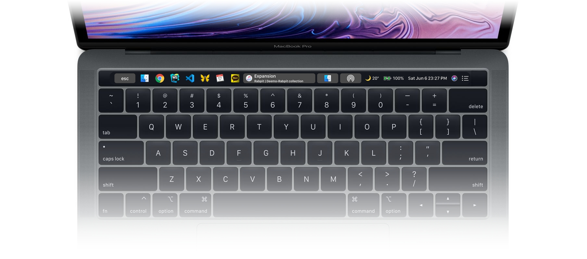
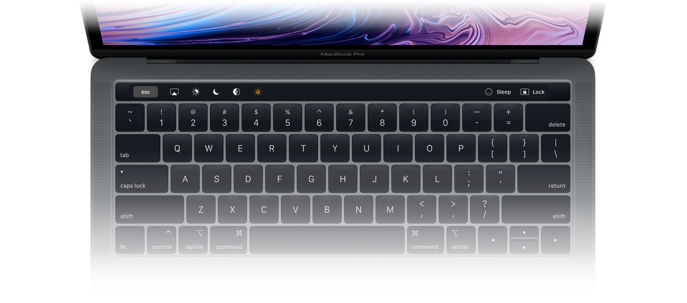

  # btt-ghp

  Better Touch Tool - GHLee's Preset

  
  

## Install

> Need BTT(Better Touch Tool)! - [Better Touch Tool](https://folivora.ai)

1. Download `ghp_v1.bttpreset` and Open
2. Import preset into BTT (From BTT Dialog)
3. Enjoy!

## Feature

- Touchbar
  - ESC
  - App Switcher Widget
  - Now Playing Widget
  - Show Finder
  - AirDrop
  - Weather Widget
  - Bettery
  - Date/Time Widget
  - Siri
  - Notification Center
  - [ On Press Ctrl ]
    - AirPlay
    - Night Shift toggle
    - Do Not Distrub toggle
    - Dark Mode toggle
    - True Tone toggle
    - Sleep
    - Lock
  - Gesture
    - Two Finger - swift right: Volume Up
    - Two Finger - swift left: Volume Down
    - Three Finger - swift right: Brightness Up
    - Three Finger - swift right: Brightness Down
- Keyboard
  - Shortcut
    - Ctrl + CMD + Arrow (Maximize Window move)
      - Left
      - Right
      - Top
      - Bottom
    - Ctrl + Option + Arrow (Window to Quarter/Corner)
      - Top Left
      - Top Right
      - Bottom Left
      - Bottom Right
    - Ctrl + Shift + Option + Arrow (Move window to next monitor)
      - Left or Right

## Reference

- [GoldenChaos-BTT](https://github.com/GoldenChaos/GoldenChaos-BTT)
